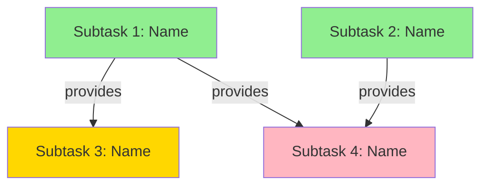

# Plan Parallel Development

Create a comprehensive feature plan divided into independent subtasks that can be executed in parallel across multiple worktrees with separate Claude instances.

## Feature Description

#$ARGUMENTS

**If the feature description is empty, ask the user:** "What feature would you like to plan for parallel development?"

## Workflow

### Phase 1: Initialize Workspace

Create the `.claude-workspace/` directory structure:

```bash
mkdir -p .claude-workspace/{worktrees,integration,scripts}
```

Create helper scripts that will be used throughout the parallel workflow.

**File: `.claude-workspace/scripts/worktree-setup.sh`**

```bash
#!/bin/bash
# Parallel Worktree Setup Script
set -e

SUBTASK=""
BRANCH=""
BASE_BRANCH="main"

while [[ $# -gt 0 ]]; do
  case $1 in
    --subtask) SUBTASK="$2"; shift 2 ;;
    --branch) BRANCH="$2"; shift 2 ;;
    --base) BASE_BRANCH="$2"; shift 2 ;;
    *) echo "Unknown option: $1"; exit 1 ;;
  esac
done

if [[ -z "$SUBTASK" || -z "$BRANCH" ]]; then
  echo "Usage: worktree-setup.sh --subtask <name> --branch <branch> [--base <base-branch>]"
  exit 1
fi

GIT_ROOT=$(git rev-parse --show-toplevel)
WORKSPACE="$GIT_ROOT/.claude-workspace"
WORKTREE_DIR="$WORKSPACE/worktrees/$SUBTASK/worktree"
STATUS_FILE="$WORKSPACE/worktrees/$SUBTASK/STATUS.yml"

mkdir -p "$(dirname "$WORKTREE_DIR")"

echo "Updating $BASE_BRANCH..."
git fetch origin "$BASE_BRANCH" 2>/dev/null || git fetch origin

echo "Creating worktree at $WORKTREE_DIR..."
git worktree add -b "$BRANCH" "$WORKTREE_DIR" "origin/$BASE_BRANCH" 2>/dev/null || \
git worktree add -b "$BRANCH" "$WORKTREE_DIR" "$BASE_BRANCH"

echo "Copying environment files..."
for env_file in "$GIT_ROOT"/.env*; do
  if [[ -f "$env_file" ]]; then
    basename_file=$(basename "$env_file")
    if [[ "$basename_file" != ".env.example" ]]; then
      cp "$env_file" "$WORKTREE_DIR/$basename_file" 2>/dev/null || true
    fi
  fi
done

echo "Updating status..."
cat > "$STATUS_FILE" << EOF
id: $SUBTASK
status: in_progress
branch: $BRANCH
worktree_path: $WORKTREE_DIR
assigned_to: $$
started_at: $(date -u +"%Y-%m-%dT%H:%M:%SZ")
completed_at: null
dependencies_met: true
conflicts: []
commit_sha: null
tests_passing: null
EOF

echo "✅ Worktree setup complete!"
```

**File: `.claude-workspace/scripts/status-check.sh`**

```bash
#!/bin/bash
# Parallel Development Status Checker

WORKSPACE=".claude-workspace"

if [[ ! -d "$WORKSPACE" ]]; then
  echo "No parallel workspace found"
  exit 1
fi

echo "━━━━━━━━━━━━━━━━━━━━━━━━━━━━━━━━━━━━━━"
echo "Parallel Development Status"
echo "━━━━━━━━━━━━━━━━━━━━━━━━━━━━━━━━━━━━━━"
echo ""

PENDING=0
IN_PROGRESS=0
COMPLETE=0
BLOCKED=0

for status_file in "$WORKSPACE"/worktrees/*/STATUS.yml; do
  if [[ -f "$status_file" ]]; then
    STATUS=$(grep "^status:" "$status_file" | awk '{print $2}')
    case $STATUS in
      pending) PENDING=$((PENDING + 1)) ;;
      in_progress) IN_PROGRESS=$((IN_PROGRESS + 1)) ;;
      complete) COMPLETE=$((COMPLETE + 1)) ;;
      blocked) BLOCKED=$((BLOCKED + 1)) ;;
    esac
  fi
done

TOTAL=$((PENDING + IN_PROGRESS + COMPLETE + BLOCKED))

echo "📊 Summary:"
echo "  Total subtasks: $TOTAL"
echo "  ✅ Complete: $COMPLETE"
echo "  🔄 In Progress: $IN_PROGRESS"
echo "  ⏸️  Pending: $PENDING"
echo "  ⛔ Blocked: $BLOCKED"
echo ""

echo "📋 Subtasks:"
echo ""

for subtask_dir in "$WORKSPACE"/worktrees/*/; do
  SUBTASK=$(basename "$subtask_dir")
  STATUS_FILE="$subtask_dir/STATUS.yml"
  TASK_FILE="$subtask_dir/TASK.md"

  if [[ -f "$STATUS_FILE" && -f "$TASK_FILE" ]]; then
    STATUS=$(grep "^status:" "$STATUS_FILE" | awk '{print $2}')
    PRIORITY=$(grep "^priority:" "$TASK_FILE" | head -1 | awk '{print $2}')

    case $STATUS in
      pending) ICON="⏸️ " ;;
      in_progress) ICON="🔄" ;;
      complete) ICON="✅" ;;
      blocked) ICON="⛔" ;;
    esac

    printf "  %s %-30s [P%s] %s\n" "$ICON" "$SUBTASK" "$PRIORITY" "$STATUS"
  fi
done
```

**File: `.claude-workspace/scripts/validate-dependencies.sh`**

```bash
#!/bin/bash
# Validates subtask dependencies

SUBTASK="$1"
WORKSPACE=".claude-workspace"

if [[ -z "$SUBTASK" ]]; then
  echo "Usage: validate-dependencies.sh <subtask-name>"
  exit 1
fi

TASK_FILE="$WORKSPACE/worktrees/$SUBTASK/TASK.md"

if [[ ! -f "$TASK_FILE" ]]; then
  echo "Subtask not found: $SUBTASK"
  exit 1
fi

DEPENDENCIES=$(awk '/^---$/,/^---$/ {print}' "$TASK_FILE" | grep "^dependencies:" | sed 's/dependencies: \[\(.*\)\]/\1/' | tr ',' ' ' | tr -d '[]')

if [[ -z "$DEPENDENCIES" || "$DEPENDENCIES" == "null" ]]; then
  echo "✅ No dependencies - ready to work"
  exit 0
fi

UNMET=()
for dep in $DEPENDENCIES; do
  DEP_STATUS_FILE="$WORKSPACE/worktrees/$dep/STATUS.yml"

  if [[ ! -f "$DEP_STATUS_FILE" ]]; then
    UNMET+=("$dep (not found)")
  else
    DEP_STATUS=$(grep "^status:" "$DEP_STATUS_FILE" | awk '{print $2}')
    if [[ "$DEP_STATUS" != "complete" ]]; then
      UNMET+=("$dep ($DEP_STATUS)")
    fi
  fi
done

if [[ ${#UNMET[@]} -eq 0 ]]; then
  echo "✅ All dependencies met"
  exit 0
else
  echo "⚠️  Unmet dependencies:"
  for dep in "${UNMET[@]}"; do
    echo "  - $dep"
  done
  exit 1
fi
```

Make scripts executable:

```bash
chmod +x .claude-workspace/scripts/*.sh
```

Create `.claude-workspace/.gitignore`:

```
worktrees/*/worktree/
**/.lock
**/*.tmp.*
*/STATUS.yml
PARALLEL_PLAN.md
integration/MERGE_LOG.md
```

Create `.claude-workspace/README.md`:

```markdown
# Parallel Development Workspace

This directory contains state for parallel development workflows.

## Structure

- `PARALLEL_PLAN.md` - Main plan with all subtasks
- `worktrees/` - Subtask-specific worktrees and state
- `integration/` - Merge planning and logs
- `scripts/` - Helper utilities

## Commands

- `/plan-parallel <feature>` - Create parallel development plan
- `/work-on <subtask>` - Start working on a subtask
- `/worktree-review` - Review current subtask
- `/merge-parallel <branch>` - Merge all subtasks

## Manual Status Check

```bash
bash .claude-workspace/scripts/status-check.sh
```

## Cleanup

After successful merge, worktrees and branches are cleaned up automatically.
To manually clean up:

```bash
git worktree list
git worktree remove <path>
```
```

### Phase 2: Research & Analysis

Launch parallel Explore agents to understand the codebase:

- Task Explore(description="Find similar patterns and existing implementations for this feature in the codebase")
- Task Explore(description="Analyze the codebase architecture, identify shared dependencies and integration points")
- Task Explore(description="Review testing conventions, patterns, and infrastructure in the codebase")

### Phase 3: Dependency Analysis

Analyze the feature to identify:

1. **Core dependencies**: What must be built first?
2. **Independent components**: What can be built in parallel?
3. **Integration points**: Where do components connect?
4. **Shared resources**: What files/modules are touched by multiple tasks?

Create a dependency graph to visualize relationships between components.

### Phase 4: Subtask Decomposition

Break the feature into **2-6 independent subtasks**, each with:

- **Clear boundaries**: Minimal file overlap with other subtasks
- **Testable independently**: Can verify completion without other tasks
- **Appropriate scope**: 2-8 hours of work per subtask
- **Explicit dependencies**: List which tasks must complete first

For each subtask, create:

**Directory**: `.claude-workspace/worktrees/<subtask-id>/`

**File**: `.claude-workspace/worktrees/<subtask-id>/TASK.md`

```yaml
---
id: subtask-1
name: descriptive-name
priority: 1
dependencies: []
estimated_hours: 4
tags: [backend, models]
---

## Objective

[Clear, single-sentence goal]

## Context

[What this subtask builds and why it's needed]

## Implementation

1. Create/modify `path/to/file.rb` - [Description]
2. Add tests in `path/to/test.rb`
3. Run test suite to verify

## Acceptance Criteria

- [ ] Specific, testable criterion 1
- [ ] Specific, testable criterion 2
- [ ] All tests passing
- [ ] No security vulnerabilities

## Files to Create/Modify

- `app/models/user.rb` - Create User model with authentication
- `db/migrate/xxx_create_users.rb` - Add users table
- `test/models/user_test.rb` - Unit tests

## Integration Points

- **Provides**: User model for authentication
- **Consumes**: None (core dependency)
- **Conflicts**: Avoid editing `app/controllers/` (handled by subtask-3)
```

**File**: `.claude-workspace/worktrees/<subtask-id>/STATUS.yml`

```yaml
id: subtask-1
status: pending
branch: parallel/subtask-1-descriptive-name
worktree_path: null
assigned_to: null
started_at: null
completed_at: null
dependencies_met: true
conflicts: []
commit_sha: null
tests_passing: null
```

### Phase 5: Generate Main Plan

Create `.claude-workspace/PARALLEL_PLAN.md`:

```markdown
---
feature: [Feature Name]
created: [Current Date]
status: planned
total_subtasks: N
completed_subtasks: 0
---

# [Feature Name] - Parallel Development Plan

## Overview

[Feature description and goals]

## Architecture

[High-level architecture explanation]

## Dependency Graph



**Legend**:
- Green: No dependencies (Wave 1)
- Yellow: Depends on Wave 1 (Wave 2)
- Pink: Depends on Wave 2 (Wave 3)

## Execution Strategy

**Parallel Waves:**

- **Wave 1** (no dependencies): subtask-1, subtask-2
- **Wave 2** (depends on Wave 1): subtask-3
- **Wave 3** (integration): subtask-4

## Subtasks

### Subtask 1: [Name]

- **ID**: subtask-1
- **Priority**: 1
- **Dependencies**: None
- **Estimated**: 4 hours
- **Status**: pending
- **Branch**: `parallel/subtask-1-name`
- **Files**: [Key files to modify]

**Objective**: [Goal]

**Implementation highlights**:
1. [Key step 1]
2. [Key step 2]

---

[Repeat for each subtask]

## Integration Plan

After all subtasks complete:

1. Review all changes
2. Merge in dependency order (see MERGE_PLAN.md)
3. Run integration tests
4. Verify feature completeness

## Shared Guidelines

- **Naming conventions**: [Project-specific]
- **Testing requirements**: All subtasks must include tests
- **Code style**: Follow existing patterns
- **Commit format**: `feat(subtask-N): description`
```

### Phase 6: Generate Merge Plan

Create `.claude-workspace/integration/MERGE_PLAN.md`:

```markdown
---
target_branch: main
merge_order: [subtask-1, subtask-2, subtask-3, subtask-4]
created: [Current Date]
---

# Merge Plan

## Merge Order (Dependency-Based)

Execute merges in this order to respect dependencies:

1. **subtask-1** (parallel/subtask-1-name) - No dependencies
2. **subtask-2** (parallel/subtask-2-name) - No dependencies
3. **subtask-3** (parallel/subtask-3-name) - Depends on subtask-1
4. **subtask-4** (parallel/subtask-4-name) - Depends on subtask-1, subtask-2

## Merge Commands

```bash
git checkout main
git pull origin main

# Wave 1
git merge --no-ff parallel/subtask-1-name -m "Merge subtask-1: [description]"
git merge --no-ff parallel/subtask-2-name -m "Merge subtask-2: [description]"

# Wave 2
git merge --no-ff parallel/subtask-3-name -m "Merge subtask-3: [description]"
git merge --no-ff parallel/subtask-4-name -m "Merge subtask-4: [description]"

# Verify
[test command]
```

## Conflict Resolution

If conflicts occur, resolve in dependency order and verify tests pass after each merge.

## Post-Merge Verification

- [ ] All tests pass
- [ ] Integration works end-to-end
- [ ] No regressions
- [ ] Documentation updated
```

### Phase 7: Display Instructions

```
✅ Parallel plan created: .claude-workspace/PARALLEL_PLAN.md

📋 Next Steps:

1. Review the plan: .claude-workspace/PARALLEL_PLAN.md
2. For each subtask you want to work on:
   - Open a NEW terminal
   - Navigate to this project
   - Start Claude Code: `claude code`
   - Run: `/work-on <subtask-name>`

3. Track progress:
   bash .claude-workspace/scripts/status-check.sh

4. When all complete, run: `/merge-parallel main`

📊 Subtask Summary:

[For each subtask, display:]
- <subtask-name> (Priority N, ~Nh) - <Objective> [pending]

Ready to start working? Run `/work-on <subtask-name>` in this or a new terminal.
```
